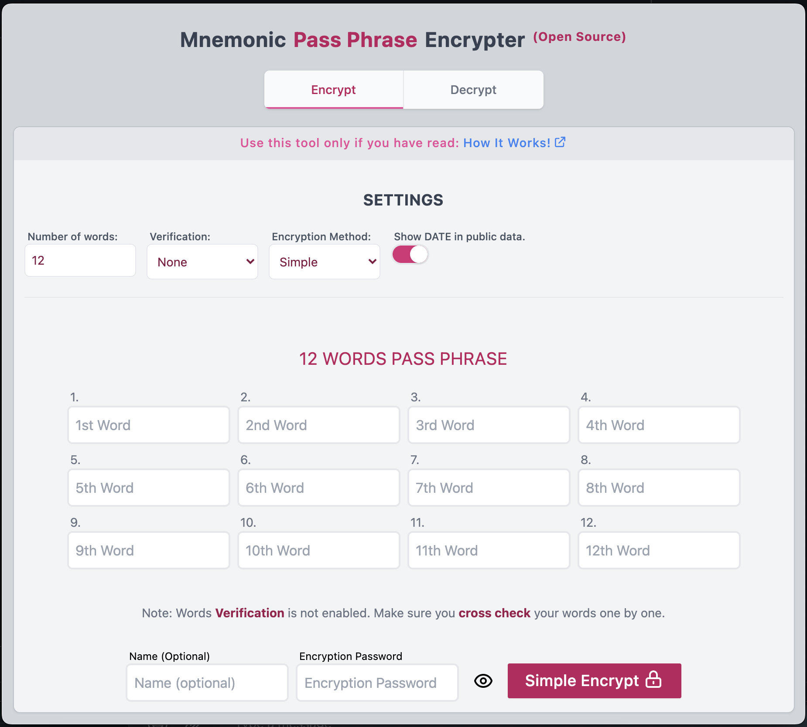
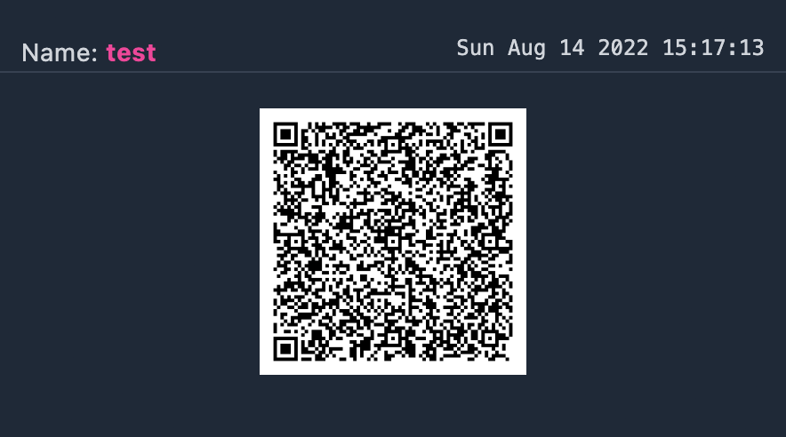
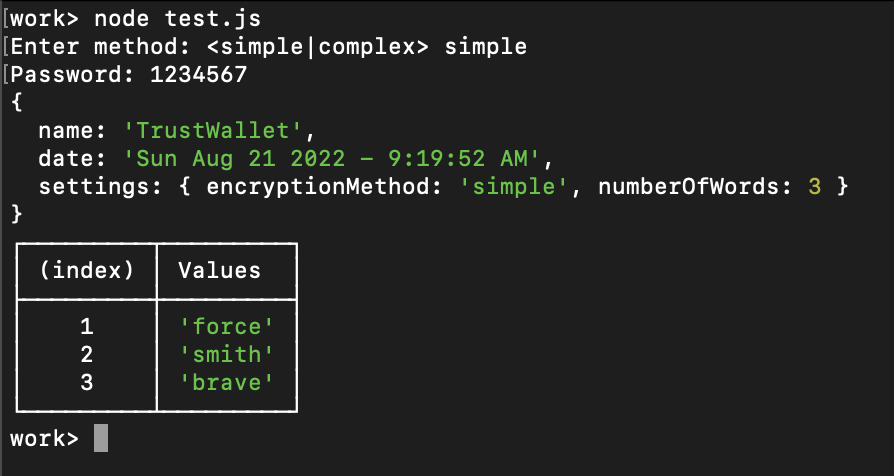

# Mnemonic Pass Phrase Encrypter

<p align="center">
  
</p>

<p align="center" style="font-size: 16px; font-weight: medium; margin-bottom: 25px">
Encrypt your  passphrase, secretKeys, backup keys e.t.c Using simple or complex <b>AES Encryption</b> in the browser. <span style="color: green">(No server or external requests) 👍 🔒 <span>
</p>
<br>

## Highlights

- Client Side AES Encryption
- Encrypt & Decrypt Interface
- Multiple Encryption methods
- Save as `json`, `qrcode` or [Standalone NodeJS Script](#standalone-nodejs-script)

## How To Use

You can either use the **online version:**

- [passphrase-encrypter.eth.link](https://passphrase-encrypter.eth.link): Hosted openly on the blockchain via [IPFS](https://ipfs.io)
- [passphrase-encrypter.pages.dev](https://passphrase-encrypter.pages.dev): Hosted and served by [Cloudflare Pages](https://pages.cloudflare.com/) directly from this repository.

OR

### Install Locally

Requires **Nodejs >= 16**

- Clone this repo
- Install dependencies - `npm install`
- Build Application - `npm run build`
- Serve Application - `npm run serve`

## Settings

- [Number Of Words](#number-of-words)
- [Verification](#verification)
- [Encryption Method](#encryption-method)
- [Show DATE in public data](#show-date-in-public-data)

### Number of Words

The number of words you want to encrypt. This also determines the number of input boxes that will be provided for you.
<br>
Min: `1` Max: `50` Default: `12`

### Verification

If enabled, This ensures that the words you entered are correct by providing another form for you to re-type and verify words.
<br>
Default: `false`

### Encryption Method

There are two encryption methods provided: `Simple` and `Complex`.
All encryption are done in your browser.

#### Simple Encryption Method

This method is direct and straight to the point. Your data is encrypted using your password directly. This means you can use any **AES Decrypter** to decrypt your **encrypted** value without depending on this application.

```js
password = "1234567";
encrypted = AesEncryptFunction(data, password);
```

#### Complex Encryption Method.

This method is **EXTREMELY SECURE** but can only be **decrypted** using this application because **it does not use your password to encrypt data.**.

Yes! Your password is used to generate a **Longer & Stronger Password** using a **`COMPLEX_ENCRYPTION_KEY` and `Md5 Hashing`** method.

```js
password = "1234567";
generatedPassword = GeneratePassword(password);
encrypted = AesEncryptFunction(data, generatedPassword);
```

### Show DATE in public data.

If enabled, Date of encryption will be publicly visible in the encrypted document. For best anonymity, this should be turned **off**.
<br>
Default: `true`

## Export Formats

- [Json Text File](#json-text-file)
- [Qrcode Image File](#qrcode-image-file)
- [Standalone NodeJS Script](#standalone-nodejs-script)

### Json Text File

Example of an exported json text file.
<br>
Password: **`1234567`**

```json
{
  "name": "test",
  "value": "U2FsdGVkX19OMXnOV9MK6/6UieQzZ2qiTMwbQ46lNIteHe5A3avTwtPGl803Ofeni2Nfw5ABl+NJ8DWR3+XMGo73ww4hCcctWfMahlds6oT14PVTCiSAhNWR54M5MKim0zqMKzu13bBnfkx8RUlJI/2oz+DbKDN2aoiGVXVolS9BMwhKUvA3v4FMq1hUu2tk"
}
```

### Qrcode Image File

Example of an exported image file. The qrcode holds a [Json Text File](#json-text-file) content.
<br>
Password: **`1234567`**

<br>
<p align="center" style="border-radius: 20px">
  
</p>
<br>

### Standalone NodeJS Script.

Requires **Nodejs >= 10**

Once downloaded, you can run on any NodeJS machine with the right arguments

```sh
# Syntax
node file.js
```

If successful the result will look like this.

<br>

<p align="center" style="border-radius: 20px">
  
</p>
<br>
