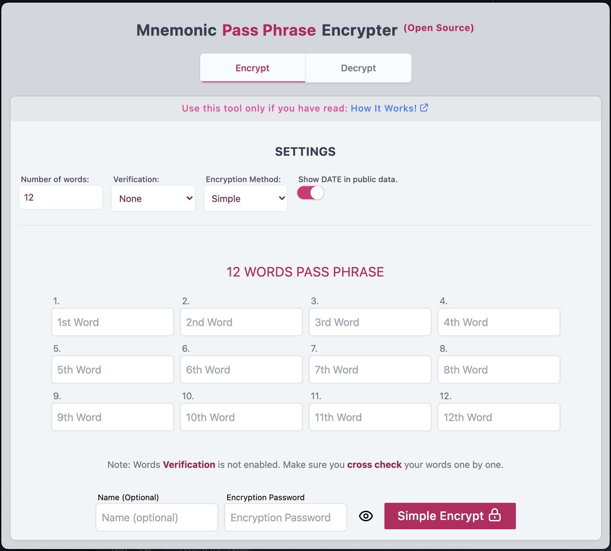
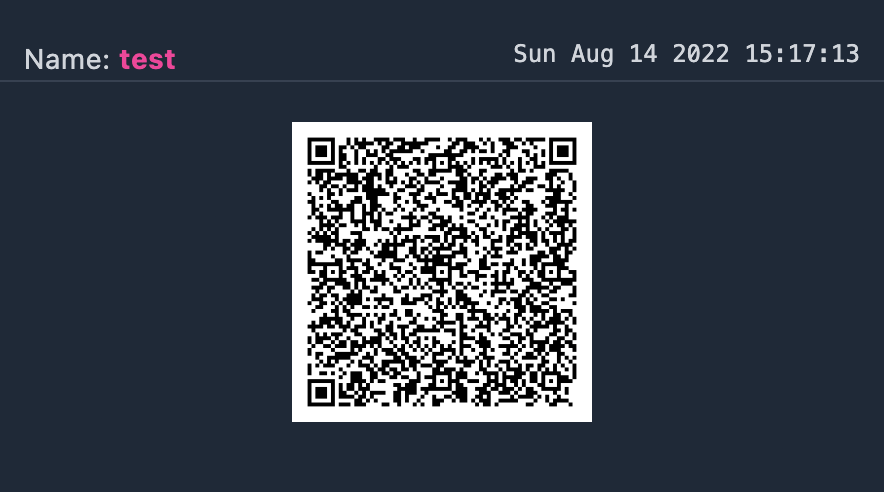
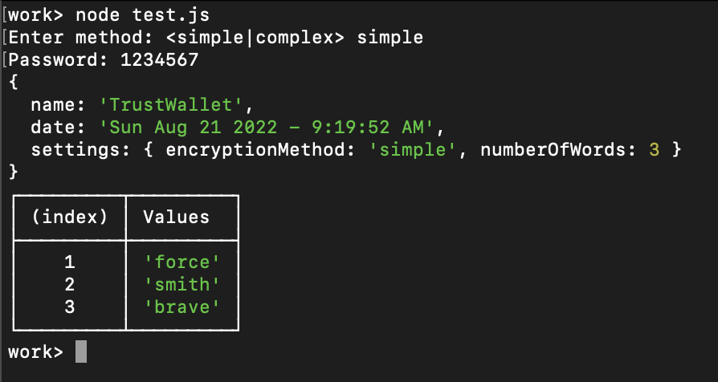

# Mnemonic Pass Phrase Encrypter

<p align="center">
  
</p>

<p align="center" style="font-size: 16px; font-weight: medium; margin-bottom: 25px">
Encrypt your passphrase, secretKeys, backup keys e.t.c using <b>Argon2id + AES-256-GCM</b> encryption in the browser. <span style="color: green">(No server or external requests) 👍 🔒 <span>
</p>
<br>

## Highlights

- Client-side **Argon2id** key derivation + **AES-256-GCM** authenticated encryption
- Encrypt & Decrypt Interface
- All encryption happens in your browser — no data leaves your machine
- Save as `json`, `qrcode` or [Standalone NodeJS Script](#standalone-nodejs-script)
- Backward compatible with v1 encrypted blobs

## How To Use

You can either use the **online version:**

- [passphrase-encrypter.eth.link](https://passphrase-encrypter.eth.link): Hosted openly on the blockchain via [IPFS](https://ipfs.io)
- [passphrase-encrypter.pages.dev](https://passphrase-encrypter.pages.dev): Hosted and served by [Cloudflare Pages](https://pages.cloudflare.com/) directly from this repository.

OR

### Install Locally

Requires **Nodejs >= 18**

- Clone this repo
- Install dependencies - `npm install`
- Build Application - `npm run build`
- Serve Application - `npm run serve`

## Security Model

### How Encryption Works

Your password is used to derive a strong 256-bit encryption key using **Argon2id** (a memory-hard key derivation function). That key is then used to encrypt your data with **AES-256-GCM**, which provides both confidentiality and tamper detection.

```
Password
    │
    ▼
Argon2id(password, random 16-byte salt) → 256-bit key
    │
    ▼
AES-256-GCM(data, key, random 12-byte IV) → ciphertext + auth tag
```

- A fresh **random salt** and **random IV** are generated for every encryption, so encrypting the same data twice produces completely different output.
- **AES-GCM's authentication tag** ensures that if anyone tampers with the ciphertext (even a single bit), decryption will fail — you'll know it's been modified.
- The encrypted output is an opaque base64 string. No algorithm names or parameters are visible in the exported file.

### Threat Model

This tool protects against an attacker who **has your encrypted file but does not have your password**. Argon2id makes brute-forcing the password computationally expensive.

This tool does **NOT** protect against:
- Keyloggers or compromised browsers
- Weak passwords (use a strong, unique password)
- An attacker who has both the file and the password

### Argon2id Parameters

| Parameter   | Value |
|-------------|-------|
| Time cost   | 2     |
| Memory cost | 2048 KiB |
| Parallelism | 1     |
| Hash length | 32 bytes (256 bits) |

## Settings

- [Number Of Words](#number-of-words)
- [Verification](#verification)
- [Show DATE in public data](#show-date-in-public-data)

### Number of Words

The number of words you want to encrypt. This also determines the number of input boxes that will be provided for you.
<br>
Min: `1` Max: `50` Default: `12`

### Verification

If enabled, this ensures that the words you entered are correct by providing another form for you to re-type and verify words.
<br>
Default: `false`

### Show DATE in public data.

If enabled, Date of encryption will be publicly visible in the encrypted document. For best anonymity, this should be turned **off**.
<br>
Default: `true`

## Export Formats

- [Json Text File](#json-text-file)
- [Qrcode Image File](#qrcode-image-file)
- [Standalone NodeJS Script](#standalone-nodejs-script)

### Json Text File

Example of an exported json text file.

```json
{
  "name": "test",
  "value": "AgR5bW...base64...=="
}
```

The `value` field contains an opaque base64 string. Only your password can decrypt it.

### Qrcode Image File

Example of an exported image file. The qrcode holds a [Json Text File](#json-text-file) content.

<br>
<p align="center" style="border-radius: 20px">
  
</p>
<br>

### Standalone NodeJS Script.

Requires **Nodejs >= 18**

Once downloaded, you can run on any NodeJS machine. It will ask for your password and automatically detect the encryption format.

```sh
node file.js
```

If successful the result will look like this.

<br>

<p align="center" style="border-radius: 20px">
  
</p>
<br>

## Migrating from v1

If you have files encrypted with a previous version of this tool (using the old "Simple" or "Complex" encryption methods), they will still work. The decrypt interface **automatically detects** v1 blobs and decrypts them using the legacy method — no action needed on your part.

To upgrade a v1 encrypted file to v2:
1. Go to the **Decrypt** page
2. Paste your old encrypted data
3. Enter your password and decrypt
4. Copy the decrypted words
5. Go to the **Encrypt** page
6. Re-enter the words and encrypt with a new password

Your data will now be protected with the stronger v2 encryption.
